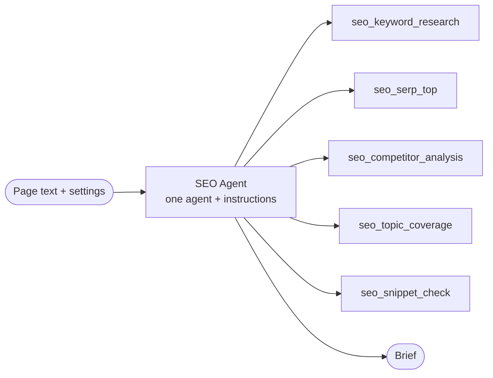
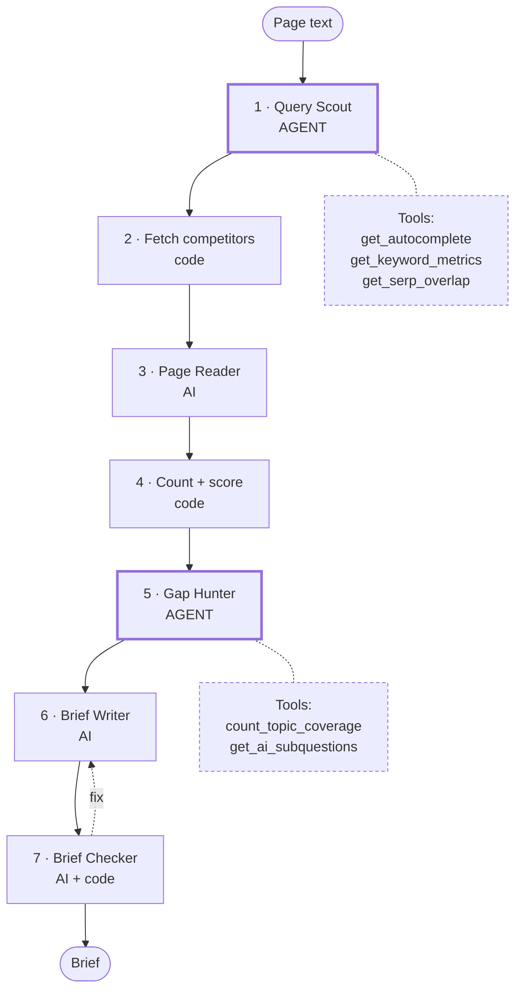

# Architecture

Last updated: 24 September 2026. One brief per page (pooled across its 1 to 3 phrases). Thresholds marked "tune" are starting values to calibrate on the eval set.

## 1. Approach: fat tools, thin agents

Almost all work lives in well-tested tools. Agents only make the few judgment calls code cannot. The build moves in stages:

1. **Tools first.** Build and test the tools as a plain Python library. Every later design reuses them.
2. **Phase 2: one agent** calls 5 consolidated tools. Used to learn fast and read transcripts.
3. **Phase 3: fixed workflow with 2 agents** (Query Scout, Gap Hunter), built only if phase 2 transcripts show the single agent skipping steps or behaving inconsistently.

Why: steps are known in advance (find phrase, collect, read, count, write), so the backbone is a workflow. Multi-agent setups cost far more tokens and add failure modes; they only pay off for wide, parallel, open-ended research. Verification is added everywhere.

## 2a. Current design: one agent with 5 tools

This is what we build and evaluate first.



- The agent decides the order of tool calls and writes the brief.
- Each tool does a whole step internally in code (fetching, cleaning, counting, scoring), so the agent cannot skip counting or invent numbers.
- The agent's instructions give the expected order: research phrases → get results → analyse competitors → measure coverage → write brief → check snippet.

### When to add more agents

Add an agent only when the evaluation (PLAN.md, phase 2) shows a specific problem:

| If the evaluation shows | Add |
| --- | --- |
| Weak or inconsistent phrase choices | Query Scout agent for phrase discovery |
| Invented or missed gaps | Gap Hunter agent that proposes and verifies gaps |
| Skipped steps or changing order between runs | Fixed workflow that forces the order |
| Uneven brief quality | Brief Checker that sends bad briefs back |

The tools stay the same in every case.

## 2c. Fixed pipeline (serves the API and UI)

`pipeline.py` calls the same 5 tools in a fixed order, then one Brief Writer LLM call:

```text
keyword_research → serp_top (per phrase) → competitor_analysis (pooled) → topic_coverage
→ brief writer (LLM: titles, description, headings) → snippet_check (code; one rewrite if a check fails)
→ Brief (counts, gaps, score and checklist filled by code from the run state)
```

A sixth step, the Draft Writer (judgment LLM, one call), writes the suggested content from the brief and the page's own facts; code checks it (phrase in H1 and first 100 words, density, length, `[ADD: …]` placeholders) and asks for one rewrite if the H1 or intro miss the main phrase.

It is the default behind the API because steps are known in advance and a UI needs predictable runs. The phase 2 one-agent design is evaluated against it on the same tools; whichever wins the evals serves the API.

## 2b. If needed later: workflow with 2 agents



An optional approval pause sits after node 1 (setting: phrase selection = approval). Nodes 2 to 7 run once per phrase, in parallel lanes.

| # | Node | Type | Job |
| --- | --- | --- | --- |
| 1 | Query Scout | Agent (max 3 rounds) | Find winnable phrases with real demand |
| 2 | Fetch competitors | Code | Google top 20 (+ AI citations in phase 3), filter, fetch, clean |
| 3 | Page Reader | AI, one call per page, parallel | Topics, page type, questions answered, evidence |
| 4 | Count + score | Code | Coverage counts, buckets, intent mix, score |
| 5 | Gap Hunter | Agent (max 3 rounds) | Propose gaps, verify with counts and demand evidence |
| 6 | Brief Writer | AI, one call | Titles, description, headings, to-do list, using state data only |
| 7 | Brief Checker | Code rules + AI rubric | Reject with reasons; max 2 rewrite loops, then deliver with a warning |

## 3. Tools

### 3.1 Consolidated tools (phase 2 agent, and later the MCP server)

| Tool | Input | Output |
| --- | --- | --- |
| `seo_keyword_research` | seed phrases, country, site strength | candidates with volume, difficulty, intent, autocomplete variants, clusters |
| `seo_serp_top` | phrase, country, n | ranked URLs with page type and SERP features |
| `seo_competitor_analysis` | URLs | cleaned text, headings, topics, page type per page (fetch + clean + read in one call) |
| `seo_topic_coverage` | topics, competitor pages, our page | per topic: competitors covering it, passages in ours, bucket |
| `seo_snippet_check` | title, description | pixel width, length, pass/fail with reason |

### 3.2 Fine-grained functions (phase 3 agents)

| Agent | Tool | Does |
| --- | --- | --- |
| Query Scout | `get_autocomplete` | Google suggestions for a phrase |
| Query Scout | `get_keyword_metrics` | Volume, difficulty, intent (bulk) |
| Query Scout | `get_serp_overlap` | Shared top-10 URLs between two phrases |
| Gap Hunter | `count_topic_coverage` | Competitors covering a topic; ours yes/no |
| Gap Hunter | `get_ai_subquestions` | Sub-questions AI engines searched (phase 3) |

Tool rules: 3 to 6 tools per agent, never more than 10; clearly different names; simple parameters (strings, numbers, under 5 per tool); anything deterministic is a code call, not an agent tool.

## 4. Data sources

Default is **free mode** (`Settings.data_mode = "free"`): the only paid calls are LLM calls. DataForSEO is an optional paid mode behind the same interfaces.

### 4a. Free mode (default)

| Data | Source | Cost and limits |
| --- | --- | --- |
| Google results, People Also Ask, related searches | Serper.dev `/search` | 2,500 free queries on signup (one-time, no card) |
| Google results when Serper is out of credits or has no key | Gemini `generateContent` with the `google_search` tool (`gemini-2.5-flash`) | Free tier, about 500 grounded requests a day. Returns cited pages, not a ranked list; no PAA. Only the phrase is sent. |
| Autocomplete and question variants | Google suggest endpoint (`suggestqueries.google.com`) | Keyless, unofficial; cached by day, called politely |
| Demand (search volume proxy) and related phrases | Bing Webmaster Tools API: `GetKeywordStats`, `GetRelatedKeywords` | Free API key; needs one verified site. Bing impressions, not Google volume. |
| Site strength for difficulty | Tranco top-1M domain list | Keyless CSV download, refreshed monthly |
| Difficulty | Computed in code from the top 10 (§5.1) | Free |
| Page content | Own fetcher: httpx + trafilatura; if too little text, a visible-text extractor (landing pages); headless Chrome fallback for JavaScript pages | Free; respects robots.txt |
| Our pages' real queries (phase 4) | Google Search Console | Free for sites we can access |

### 4b. DataForSEO mode (optional, paid)

| Data | Source | Notes |
| --- | --- | --- |
| Google results | DataForSEO Google Organic SERP API | $0.0006 per page (standard queue), $0.0012 (priority), $0.002 (live) |
| Volume, difficulty, intent | DataForSEO Labs | Bulk: up to 1,000 keywords per request |
| Phrases a page ranks for | DataForSEO Labs `ranked_keywords` | Works for a domain or a single page |
| Autocomplete | DataForSEO Google Autocomplete | Same base price as organic SERP |
| Page content | Own fetcher: httpx + trafilatura; headless browser fallback | Respect robots.txt |
| Entities (optional) | Google Cloud Natural Language `analyzeEntities` | Salience 0 to 1 |
| Official volume (later) | Google Ads API `GenerateKeywordIdeas` | Needs Ads account + developer token |
| AI citations (phase 3) | Gemini grounding with Google Search, OpenAI and Anthropic APIs with web search, Perplexity API | Returns cited URLs; Gemini also returns its search queries |

Do not use Google's Custom Search JSON API: closed to new customers, shuts down 1 January 2027.

Interfaces: `SearchProvider`, `KeywordProvider`, `PageFetcher`, `LLMProvider`, `EmbeddingProvider`, `AICitationProvider`. In free mode a `FallbackSearch` tries Serper first and moves to Gemini grounding when Serper has no key or no credits. Cache every call by (inputs, date). Log cost per call.

## 5. Algorithms

### 5.1 Phrase discovery (node 1)

**A. Gather candidates from four sources**
1. LLM seeds: 15 to 20 buyer-language phrases across intents.
2. KeyBERT on the page text: 2 to 4-word phrases, MMR for diversity.
3. Borrow the map: search the best 3 seeds, take top pages, call `ranked_keywords` on them (DataForSEO mode). In free mode: Bing related keywords for the best seeds.
4. Autocomplete (plus "how/what/best/vs" question variants) and keyword suggestions on the best seeds.

**B. Filter:** drop phrases without demand, then difficulty above the site-strength ceiling.
- Demand in DataForSEO mode: volume >= 50/month (tune).
- Demand in free mode: Bing impressions >= 10/month (tune), **or** the phrase appears in Google autocomplete (Google only suggests phrases people search). The brief labels which evidence was used.

**Difficulty in free mode** (one source: our code). For each of the top 10 results, site strength from its domain's Tranco rank:

| Tranco rank | Strength (tune) |
| --- | --- |
| <= 1,000 | 1.0 |
| <= 10,000 | 0.8 |
| <= 100,000 | 0.55 |
| <= 1,000,000 | 0.3 |
| not listed (small site) | 0.1 |

Forum and user-generated pages count 0.1 whatever the domain. `difficulty = round(100 × mean strength of the top 10)`. Needs a SERP call per phrase, so it runs after the demand filter and fit pre-rank, on at most `cluster_max_candidates` phrases.

| Site strength | Difficulty ceiling (DataForSEO, tune) |
| --- | --- |
| new | 30 |
| growing | 45 |
| established | 60 |

**C. Cluster:** phrases sharing >= 3 URLs in their top 10 form one cluster served by one page.

**D. Rank clusters:**
```text
group_score = fit × demand × winnability
  fit         = embedding similarity(page, phrase) in [0,1], confirmed by an LLM yes/no
  demand      = log(total monthly volume of the cluster)
  winnability = 1 − difficulty/100, adjusted by site strength and weak-spot signals
```
Weak-spot signals raise winnability: forums or Reddit in the top 10, small sites ranking (2+ domains outside the Tranco top 1M), stale pages (old years, dead prices).

**Search Console mode:** replace step A with the page's queries at positions 4 to 20, sorted by impressions.

### 5.2 Competitor filtering (node 2)

From the top 20, apply in order, keep 5 to 10 pages from >= 3 distinct domains:
1. Authority outliers (Wikipedia, Amazon, directories like G2, big media) by domain-strength threshold (tune).
2. Wrong format: forums, videos, login pages, PDFs.
3. Different intent or business model: keep our page type if enough exist, else the dominant type + intent flag.
4. Length outliers: outside 0.3x to 3x median word count (tune).
5. Domain diversity: max 2 pages per domain.

Phase 3: add pages cited in >= 2 AI samples, tagged "AI", after the same filters. Always return kept and dropped lists with reasons.

### 5.3 Gap detection (nodes 3, 4, 5)

A. Topics from each page: headings, Page Reader topic list, optional entities.
B. Merge duplicates: embed topics, group above similarity threshold (0.90 for Gemini embeddings; synonyms score 0.91 to 0.95, different topics 0.79 to 0.87).
C. Coverage by meaning: split pages into numbered passages (paragraph boundaries kept). One bulk-LLM call per page, in parallel, names which passages discuss each topic; code counts them. A competitor covers a topic if its Page Reader listed it or at least one passage discusses it. Unmatched People Also Ask / autocomplete questions are labelled in the same call, so gap coverage is counted the same way.
   Why not embedding thresholds: on Gemini embeddings, topic-vs-passage similarity overlaps (matches 0.81 to 0.89, non-matches up to 0.84; retrieval task types overlap too), so no threshold separates them. Measured 24 September 2026.
D. Buckets by share of competitors covering the topic:

| Bucket | Rule (tune) |
| --- | --- |
| Must cover | >= 60% |
| Worth covering | 20% to 60% |
| Rare | < 20% |
| Noise | boilerplate, brand names, off-intent |

E. A rare topic becomes a gap only with demand evidence: People Also Ask, related searches, a phrase competitors rank for, or (phase 3) an AI sub-question.

### 5.4 Intent classification (node 4)

Intent is read from the page types Google shows, not the query words.
1. Query-level intent: DataForSEO intent endpoint (for early filtering).
2. Per-result page type, cheapest first: URL patterns and schema.org type → SERP features → small LLM with 5 to 10 few-shot examples.

Page types: listicle, guide/how-to, product/landing, category/directory, comparison, tool, forum, video, news.

| Top-10 mix | Verdict |
| --- | --- |
| One type >= 60% | Clear intent; flag if ours differs |
| No type > 50% | Mixed; mild or no flag |
| Our type absent | Strong mismatch flag |

### 5.5 Scoring (node 4)

BM25-style saturation (k = 1.2) weighted by competitor coverage:
```text
for each topic t in must-cover and worth-covering:
  w_t = share of competitors covering t
  n_t = passages in our page covering t
  s_t = n_t / (n_t + 1.2)        # 0, 0.45 at 1, 0.71 at 3

content_score = min(100, 100 × Σ(w_t × s_t) / Σ(w_t × 0.77))
```
Checklist beside the score (pass/fail): phrase in title and H1, title <= ~600 px, description <= ~158 characters, intent flag, stuffing warning when a topic appears more often than in 90% of competitors.

Validation: leave-one-out topic model; pages ranked 1 to 5 should score higher on average than 11 to 20. Use for tuning, never as a ranking promise.

### 5.6 AI citation verification (phase 3)

- Several real-question phrasings per phrase; repeated runs per engine (60 to 100 samples per prompt for stability; cheap default 2 engines × 30).
- Normalise URLs (resolve redirects, strip tracking, canonical page).
- Report citation frequency (e.g. "cited in 33 of 60 samples, 55%"), never a rank.
- Keep Gemini's search queries as sub-questions.
- Label as "API sample"; API vs app parity is not yet established.

## 6. LLM and framework

- **Framework:** LangGraph. Phase 2: tool-calling loop. Phase 3: state graph with parallel lanes (Send), checkpointer, interrupt for approval, per-node retry policy.
- **Structured output:** every LLM call returns Pydantic-validated JSON; one retry, then raise.
- **Model tiers** (names are settings; pick by bake-off on the eval set, cheapest within a few points of best):

| Tier | Used by | Shortlist to test (Sep 2026) |
| --- | --- | --- |
| Judgment | Query Scout, Gap Hunter, Brief Writer | Claude Opus 5.5, GPT-5.6 Sol, Gemini 3.1 Pro |
| Bulk | Page Reader, page type, coverage yes/no | GPT-5.6 Luna; open-weights options (MiMo-V2.6-Pro, GLM-5.3, Kimi K3) |
| Checker | Brief Checker | A judgment model from a different family than the writer |

- **First implementations (until the bake-off):** DeepSeek (OpenAI-compatible API) for all LLM tiers; Gemini embeddings API for embeddings. Both sit behind `providers/llm.py` and `providers/embeddings.py`, so the bake-off only changes settings or one file.
- **Embeddings:** shortlist Qwen3-Embedding-8B, Qwen3-Embedding-0.6B, BGE-M3; pick by agreement with 100 hand-labelled passage/topic pairs.

## 7. Harness rules

| Rule | Detail |
| --- | --- |
| Shared state | One `Run` record; workers read and write it, never message each other |
| Narrow context | Page Reader sees one page; Brief Writer sees counts, not raw pages |
| Save every step | Checkpoint after each node; resume without repeating paid calls |
| Retries | Exponential backoff on API errors |
| Loop limits | Agents max 3 rounds; checker max 2 rewrites |
| Budget guard | On time or cost limit, reduce depth (fewer pages or samples) and mark "reduced depth" |
| Concurrency | Batch parallel calls (about 8 at a time) to respect rate limits |
| Tracing | Log every prompt, tool call, tokens, cost and time per node |

## 8. Accuracy guards

| Error | Guard |
| --- | --- |
| Phrase nobody searches | Code gate on real volume |
| AI miscounts | AI names topics; code counts |
| Synonyms double-counted | Embedding merge before counting |
| Invented gap | Coverage check + demand evidence required |
| Random AI answers | Frequency across many samples |
| Broken page text | Length check, browser refetch |
| Invented facts in brief | Writer limited to state data; checker flags unsupported claims |
| Title too long | Pixel-width check |
| Kind checker | Different model family; yes/no rubric items |
| Wrong JSON shape | Schema validation, one retry, then fail |

## 9. Core models

```python
class Settings(BaseModel):
    phrases_per_run: int = 3
    phrase_selection: Literal["auto", "approval"] = "auto"
    pages_per_phrase: int = 20
    country: str = "US"
    site_strength: Literal["new", "growing", "established"] = "new"
    surfaces: list[str] = ["google"]
    pool_mode: Literal["google", "merged", "per_surface"] = "google"
    time_budget_s: int = 300

class Phrase(BaseModel):
    text: str
    volume: int
    volume_source: str = "dataforseo"   # or "bing" / "autocomplete"
    difficulty: int
    difficulty_source: str = "dataforseo"  # or "computed"
    intent: str
    cluster: list[str] = []
    reason: str = ""

class Page(BaseModel):
    url: str
    source: str            # "google#3" or "gemini 12/30"
    page_type: str
    text: str
    headings: list[str]
    topics: list[str] = []

class TopicCount(BaseModel):
    topic: str
    covered_by: int
    total: int
    ours_passages: int
    bucket: Literal["must", "worth", "rare", "noise"]

class Gap(BaseModel):
    topic: str
    covered_by: int
    evidence: str          # the question or phrase proving demand

class Brief(BaseModel):
    phrases: list[Phrase]  # one brief per page; main phrase first, 1 to 3
    titles: list[str]
    description: str
    must_cover: list[TopicCount]
    gaps: list[Gap]
    headings: list[str]
    intent_flag: str | None
    score: int
    score_arithmetic: str = ""   # shown beside the score (PRD §5.8)
    checklist: dict[str, bool]

class Run(BaseModel):
    page_text: str
    settings: Settings
    phrases: list[Phrase] = []
    competitors: list[Page] = []
    coverage: list[TopicCount] = []
    gaps: list[Gap] = []
    brief: Brief | None = None
    cost_usd: float = 0.0
    costs: list[CostEntry] = []   # label + usd per paid call
    notes: list[str] = []         # "reduced depth", dropped pages with reasons
```

## 10. Folder structure

```text
seo-engine/
├── CLAUDE.md
├── PLAN.md
├── README.md
├── pyproject.toml
├── .env.example
├── docs/
│   ├── PRD.md
│   └── ARCHITECTURE.md
├── src/seo_engine/
│   ├── models.py
│   ├── config.py
│   ├── providers/
│   │   ├── search.py
│   │   ├── keywords.py
│   │   ├── fetcher.py
│   │   ├── llm.py
│   │   └── embeddings.py
│   ├── tools/
│   │   ├── keyword_research.py
│   │   ├── serp_top.py
│   │   ├── competitor_analysis.py
│   │   ├── topic_coverage.py
│   │   └── snippet_check.py
│   ├── agent/
│   ├── workflow/
│   └── mcp_server.py
├── evals/
│   ├── pages/
│   ├── gold_briefs/
│   └── run_evals.py
├── tests/
└── cache/
```

## 11. Key references

- Anthropic, Building effective agents: https://www.anthropic.com/research/building-effective-agents
- OpenAI, A practical guide to building agents: https://cdn.openai.com/business-guides-and-resources/a-practical-guide-to-building-agents.pdf
- Google, AI features and your website: https://developers.google.com/search/docs/appearance/ai-features
- Google, Custom Search JSON API notice: https://developers.google.com/custom-search/v1/overview
- DataForSEO SERP pricing: https://dataforseo.com/pricing/google-serp/google-organic-serp-api
- DataForSEO ranked_keywords: https://docs.dataforseo.com/v3/dataforseo_labs-google-ranked_keywords-live/
- Surfer, SERP Analyzer competitor rules: https://docs.surferseo.com/en/articles/7831167-getting-started-with-serp-analyzer
- Search Engine Land, content scoring and BM25: https://searchengineland.com/content-scoring-tools-work-but-only-for-the-first-gate-in-googles-pipeline-469871
- SparkToro, AI recommendation consistency: https://sparktoro.com/blog/new-research-ais-are-highly-inconsistent-when-recommending-brands-or-products-marketers-should-take-care-when-tracking-ai-visibility/
- Gemini grounding with Google Search: https://ai.google.dev/gemini/docs/google-search
- Cemri et al., Why Do Multi-Agent LLM Systems Fail?: https://arxiv.org/pdf/2503.13657

## 12. API and web UI

- **Backend:** FastAPI in `src/seo_engine/api/`. Runs execute in a background thread; each run is a JSON file in `runs/` (git-ignored), updated after every pipeline step.

| Method | Path | Does |
| --- | --- | --- |
| GET | `/api/health` | Which providers have keys (booleans only, never the keys) |
| GET | `/api/settings/defaults` | Default run settings for the form |
| POST | `/api/extract` | Import a public page's readable text for review (no private addresses; robots.txt respected) |
| POST | `/api/runs` | Start a run from page text and settings; returns its id |
| GET | `/api/runs` | Run history (summaries) |
| GET | `/api/runs/{id}` | Status, step progress, brief and details (competitor text left out) |
| GET | `/api/runs/{id}/report.docx` | The brief and suggested draft as a Word document |
| DELETE | `/api/runs/{id}` | Delete a run |

- **Frontend:** React + TypeScript (Vite) in `web/`. It polls `/api/runs/{id}` while a run is going, then shows the brief. The Vite dev server runs on port 4280 and proxies `/api` to `localhost:8420`; in production FastAPI serves `web/dist`.

